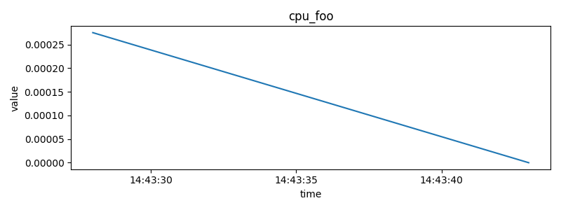
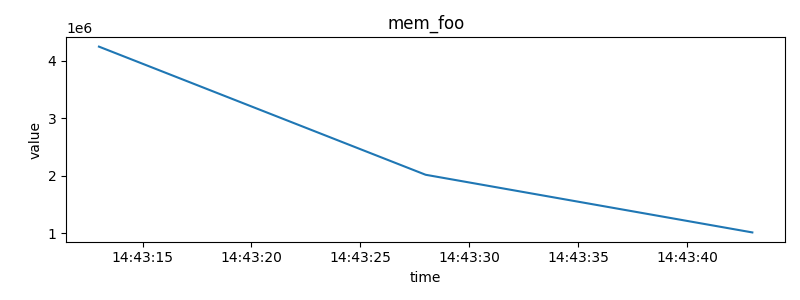
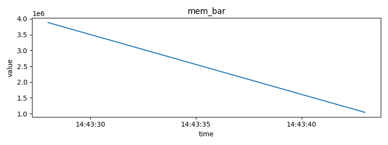

This repository implements a **CI** for **http-echo-app**.

It provision a **multi-node KinD Kubernetes cluster**, deploy **Ingress and two HTTP echo apps (`foo` and `bar`)**, performs **load testing**, and posts metrics as a **comment on the PR**.

---

## Overview

- Triggers CI workflow on **each pull request** to the main branch.
- Provision a **multi-node Kubernetes cluster** using **KinD** on the CI runner (localhost).
- Deploys **Ingress-NGINX** controller for routing.
- Deploys two **http-echo** applications:
  - `foo` → returns `"foo"`
  - `bar` → returns `"bar"`
- Configures ingress routing:
  - `http://foo.localhost` → routes to `foo` service
  - `http://bar.localhost` → routes to `bar` service
- Verifies that **Ingress** and **Deployments** are healthy before proceeding.
- Runs a **randomized load test** targeting both endpoints.
- Captures **metrics** (avg, p90, p95, req/s, failure rate, etc.)
- Posts the **metrics summary as a PR comment**.

---

## Tech Stack

- **GitHub Actions** – CI workflow orchestration  
- **KinD (Kubernetes in Docker)** – Local multi-node Kubernetes cluster  
- **Helm** – Deployments and Ingress configuration  
- **Prometheus & Grafana (via kube-prometheus-stack)** – Metrics collection and visualization  
- **Bash / Python** – Orchestration and load testing scripts  

---

## Repository Structure

```bash
.
├── charts
│   └── http-echo
│       ├── Chart.yaml
│       ├── templates
│       │   ├── _helpers.tpl
│       │   ├── deployment.yaml
│       │   ├── ingress.yaml
│       │   └── service.yaml
│       └── values.yaml
├── kind-config.yaml
├── README.md
└── scripts
    ├── collect_metrics.py
    ├── loadtest.py
    ├── run_all.sh
    └── wait_for_ready.sh
```

---

## How It Works

### Workflow Summary (`.github/workflows/ci.yaml`)

The CI pipeline runs automatically on:
- `pull request` to the **main** branch  
- Every **pull request** targeting `main`

Steps performed:

1. **Set up environment**
   - Installs dependencies (kubectl, helm, kind, Python)
2. **Create KinD cluster**
   - Multi-node setup (1 control-plane + 2 workers)
3. **Install Ingress Controller**
   - Uses `ingress-nginx` Helm chart
4. **Deploy Monitoring**
   - Installs Prometheus and Grafana via `kube-prometheus-stack`
5. **Deploy Applications**
   - Installs `foo` and `bar` http-echo apps using Helm
6. **Configure Ingress Routing**
   - Routes `foo.localhost` → foo service  
     `bar.localhost` → bar service
7. **Run Health Checks**
   - Ensures pods, services, and ingress are healthy
8. **Run Load Tests**
   - Simulates traffic for 30 seconds and records metrics
9. **Post Results**
   - Saves results as `metrics_summary.json` and PNG graphs  
   - If running in PR context, posts metrics as a comment  

---

## Example Output


Example summary (from `metrics_summary.json`):

```json
{
  "cpu_foo": { "avg": 0.000111, "p90": 0.000000, "p95": 0.000000 },
  "cpu_bar": { "avg": 0.000244, "p90": 0.000143, "p95": 0.000143 },
  "mem_foo": { "avg": 2162688.0, "p90": 1015808.0, "p95": 1015808.0 },
  "mem_bar": { "avg": 2271914.66, "p90": 1019904.0, "p95": 1019904.0 }
}
```

You should see the below in the artifact under metrics directory.

### CPU foo


---

### CPU foo


---

### Memory foo


---

### Memory bar


---

### Memory Node
